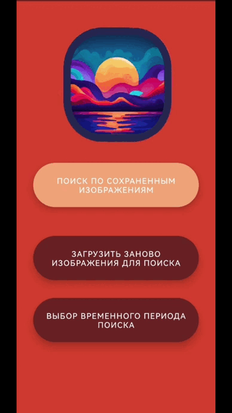

# Android App CLIPIS (CLIP Image Search)

## 1. Основная идея
Мобильное Android приложение CLIPIS помогает осуществлять поиск изображений по альбому фотокамеры смартфона. 

## 2. ⚠️ Системные и аппаратные требования к смартфону
1.	Android – версия 7.0 (Nougat) и выше;
2.	Оперативная память (ОЗУ) – 2ГБ и выше;
3.	Постоянная память (ПЗУ) – 270MБ (129МБ для установки приложения и 141МБ – резерв памяти приложения);
4.	Процессор – arm64-v8a или x86_64. 

## 3. Использование проекта
### 3.1 Быстрый старт 

```
Скачайте Android Studio->загрузите zip-файл или папку git clone'App_ClipIS'-> Откройте проект с помощью Android Studio-> подключитесь к своему телефону для компиляции с помощью USB
Скачать папку "intermediates" по ссылке: https://disk.yandex.ru/d/pNxglxQqI4y6gw и заменить содержимое папки App_ClipIS\app\build\intermediates на содержимое папки "intermediates"
```

### 3.2 Дерево каталогов

```
"App_ClipIS/app/src/"Следующий каталог (описаны ключевые файлы)
└─main
    │  AndroidManifest.xml
    │  
    ├─assets--Папка ресурсов
    │      .gitattributes
    │      image_encode.ptl--Модель кодировщика изображений (будет добавлена после публикации приложения и получения лицензии)
    │      tiny_text_encode.ptl--Модель кодировщика текста (будет добавлена после публикации приложения и получения лицензии)
    │      vocab.txt--Словарь для токенизации
    │      
    ├─java--Ключевые части программы
    │  └─org
    │      └─pytorch
    │          └─helloworld
    │                  Bean.kt--Реализует необходимые классы для хранения содержимого элемента
    │                  ChoiceActivity.kt--Первая страница
    │                  FloatArrayAdapter.kt--Необходимый класс для реализации преобразования типов для сохранения данных об изображениях
    │                  ImageProcessingTask.kt--Класс обработки изображений
    │                  MainActivity.kt--Страница обработки изображений и текстового запроса
    │                  MyAdapter.kt--Необходимый класс для реализации ViewHolder
    │                  ShareData.kt--Класс для реализации хранения глобальных общих переменных
    │                  Text2ImageActivity.kt--Интерфейс отображения изображения
    │                  Tokenizer.kt--Класс предварительной обработки текста（string->token）
    │                  
    └─res--Файл ресурсов интерфейса
        ├─anim--Анимация переходов между страницами
        │      slide_in_right.xml
        │      slide_in_left.xml
        │      
        ├─drawable
        │      bg_1.png--Фоновое изображение
        │      ic_launcher_background.xml--Дизайн значков
        │      round_corner.xml--Внешний дизайн дисплея с изображением
        │      rounded_button.xml--Дизайн кнопок
        │      search_box.xml--Дизайн текстового поля поиска
        │      
        ├─drawable-v24
        │      ic_launcher_foreground.xml
        │      
        ├─layout--Файл макета пользовательского интерфейса, соответствующий файлу kotlin
        │      activity_choice.xml
        │      activity_main.xml
        │      image_show.xml
        │      list_item.xml
        │      
        ├─mipmap-hdpi
        │      logo_clipis.png
        │      logo_clipis_round.png
        │      
        ├─mipmap-mdpi
        │      logo_clipis.png
        │      logo_clipis_round.png
        │      
        ├─mipmap-xhdpi
        │      logo_clipis.png
        │      logo_clipis_round.png
        │      
        ├─mipmap-xxhdpi
        │      logo_clipis.png
        │      logo_clipis_round.png
        │      
        ├─mipmap-xxxhdpi
        │      logo_clipis.png
        │      logo_clipis_round.png
        │      
        ├─values--Основной файл дизайна
        │      colors.xml
        │      strings.xml
        │      styles.xml
        │      
        └─xml
                file_paths.xml
                provider_paths.xml
```

### 3.3 Демонстрация работы приложения

#### 3.3.1 Использование поиска по дате
Поиск по дате можно осуществить только при загрузке изображений из галереи (данная функция недоступна при поиске по сохраненным данным).

Для использования поиска по дате необходимо нажать на соотвествующую кнопку, выбрать временной интервал и нажать "СОХРАНИТЬ" в правом верхнем углу. После этого выбранная дата отобразится внизу начальной страницы. Осуществить поиск можно, нажав "Загрузить заново изображения для поиска".

⚠️ При отсуствии изображений в данный временной период приложение сообщит об этом.


#### 3.3.2 Использование поиска с загрузкой из галереи
Производить поиск можно с помощью запросов на английском языке.

 

Также производить поиск можно с помощью запросов на любом другом языке, используя встроенный в клавиатуру переводчик на английский язык.


#### 3.3.3 Использование поиска по сохранённым 
При поиске по сохраненным изображениям используются изображения загруженные из галереи в последний раз.

 
